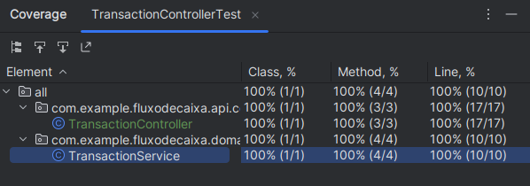

## Aplicação de Fluxo de Caixa

### Tecnologias e bibliotecas utilizadas:
* Java 17
* Lombok
* Docker
* Docker Compose
* JUnit 5
* Mockito
* MySQL
* Flyway
* Spring Boot 3.0.6
* Actuator [http://localhost:8080/actuator]

### Execução do projeto:
#### Navegar até o diretório onde foi clonado o projeto e execute o comando `docker compose up -d`
após o projeto ser executado, basta importar a coleção do postman que está na pasta `postman_collection`
na raiz do projeto, para testar a aplicação.

### Testes
#### Foram implementados testes de unidade, a imagem a seguir mostra a cobertura de código:

