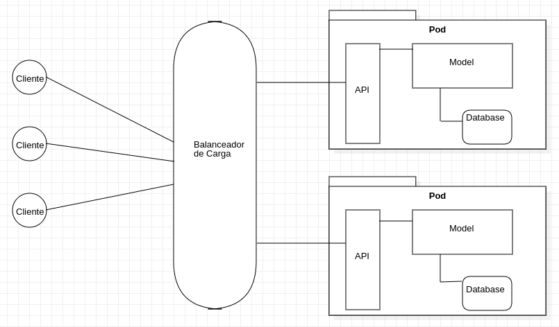

## Aplicação de Fluxo de Caixa
Aplicação de fluxo de caixa, utilizando arquitetura de Microserviços, 
em conjunto com bas práticas de desenvolvimento de software
clean code e SOLID e escalabilidade.

### Arquitetura da Aplicação

### Padrões de microserviços utilizados
* Health check API
* Shared database

### Padrões de projetos utilizados
* Builder
* Singleton
* DTO (Data Transfer Object)
* IoC (Inversão de Controle)

### Tecnologias e bibliotecas utilizadas:
* Java 17
* Lombok
* Docker
* Docker Compose
* JUnit 5
* Mockito
* MySQL
* Flyway
* Spring Boot 3.0.6
* Actuator [http://localhost:8080/actuator]

### Execução do projeto:

#### Obs: Ferramanetas nescessárias para executar o projeto, Git e Docker
Clone o projeto utilizando em sua máquina utilizando o comando a seguir: 
`git clone git@github.com:fabribh/fluxo-de-caixa.git` utilizando SSH, caso contrário
faça o download do mesmo pelo link a seguir: https://github.com/fabribh/fluxo-de-caixa/archive/refs/heads/main.zip

Navegar até o diretório onde foi salvo o projeto, vá até à pasta raiz do projeto em
`/caixa` e execute o comando `docker compose up -d`
após o projeto ser executado, basta importar a coleção do postman que está na pasta `postman_collection`
na raiz do projeto, para testar a aplicação.

### Testes
#### Foram implementados testes de unidade, a imagem a seguir mostra a cobertura de código:

